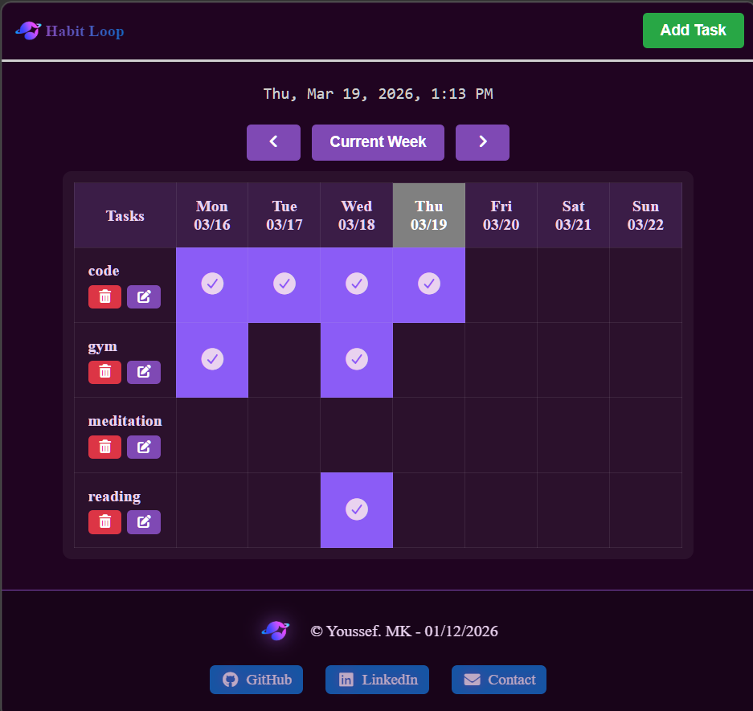

>Live Demo : https://yusef-mk.github.io/habit-loop/

>habit loop Screenshot :

>Web Project : Habit Loop

A weekly habit tracker designed to help users build consistency through a visual, interactive grid. This project focuses on managing data relationships and persistent browser storage.

>Features included :

1-Weekly Grid View: Interactive table that dynamically generates dates for the current, previous, or future weeks.  
2-Persistent Data: Integrated localStorage to ensure your habits and completion history remain saved even after closing the browser.  
3-Smart Task Management: Full CRUD (Create/Read/Update/Delete) functionality for habits.  
4-Real-time Feedback: A custom "Toast" notification system to alert users when tasks are added, updated, or deleted.  
5-Responsive UX: Optimized for mobile with a sticky "Tasks" column, ensuring you can use it on the go .  
6-Visual Polish: Includes a "Shiny" glassmorphism footer and a dynamic clock at the top updated every second.

>Tech Stack :

-HTML5   
-CSS3   
-JavaScript (ES6+)   
Icons: FontAwesome   
Localstorage API  

>Project Structure :

.  
├── index.html  
├── README.md       
├── js/  
│   └── script.js   
├── css/  
│   └── style.css  
└── assets/

>Technical Challenges Overcome :

1-Dynamic Date Logic : Implementing the "Current Week" logic required calculating the start of the week (Monday) and then generating the correct dates for all seven columns. I used a while loop to find the nearest Monday and a refreshWeek function to rebuild the UI whenever the user navigates through time.  
2-Unique Identifier System:checking a habit on "Monday" checks it for every Monday in history, I added an ID system for table cells. Each cell is assigned an ID based on a combination of the task name and the specific date. This allows me to use an array to track precise entries across infinite weeks.

>How to Run:

Clone the repository.  
Open index.html in your browser.  
Add your first habit , (start your "War").

>01-2026 Youssef .MK
